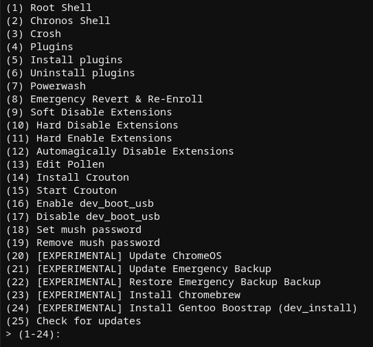

# murkmod: Why Should You Care?

Ok. Oooo boy. This blog post has been a long time coming, and I think it's time I finally write it. This post covers murkmod, its early development history, controversy, and its continued usefulness today. Let's dive right in.

## Early Development & Excess Naivete

I was an avid fakemurk user for about a month before I started developing murkmod. I loved it, sure, but I wanted *more*. **Lots more**. Thus, murkmod was born out of my unneccesary need to be in control of my Chromebook. Within a day of its conception, murkmod was already able to install itself from a freshly fakemurked Chromebook and had neofetch running directly from mush. But that wasn't enough. Over the next week, I began to develop the plugin system, adding support for a few little script that I had put together to be modularly downloaded from the Github repo.

Within two weeks, I was writing plugins like it was going out of fashion - I created nine in total. mush had been updated far beyond what I would have originally thought possible with a whopping 16 options from the main menu. 

## Controversy & the MW Proposal

At this point, murkmod had been gaining quite a traction in the community as "the thing that bricks chromebooks", which wasn't entirely false - it did have some... how do you say... *issues* (which are resolved!). MercuryWorkshop reached out to me and asked me why I hadn't created a PR to get my features and improvements merged into fakemurk. At that point, I hadn't even considered it a possiblity - why would MercuryWorkshop - *the* MercuryWorkshop - want me, a stupid little skid to contribute to fakemurk? Surely my code wasn't good enough for their standards. So, of course, I got in contact. We discussed for a little while, and I was told to make a PR. Of course, I asked a simple clarifying question: What features did they want me to merge? I never got a response to this question - and I never made the PR.

## So, what does it actually do, anyway?

Let me answer that question with a question. What *doesn't* it do?

There's quite a lot it doesn't do, actually. but it does this much:

## And why should I use it, exactly?

If you want a **maintained**, **stable**, and **updated** alternative to stock fakemurk, then murkmod is for you - it takes the simple parts of fakemurk and turns them into tools for power users. Is there a feature you don't like? Change it. A missing option? Add it. All through the magic of plugins.

Also, thanks to the magic of SH1mmer-SMUT (post coming Soon&trade;), it can be installed directly to the drive without having to install it from a previously fakemurked Chromebook.

